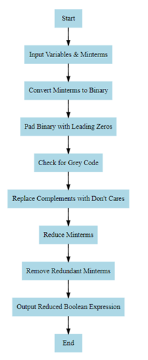

 Boolean Logic Optimizer

A lightweight C++ tool for simplifying Boolean expressions using the Quine–McCluskey algorithm. Designed to handle binary inputs and generate minimized expressions through prime implicant reduction. Ideal for engineers, logic designers, and embedded system developers.

 How It Works

The program takes minterms as input, processes them into binary groups, compares them iteratively, and eliminates redundancies using a prime implicant chart.

 Features

Implements full Quine–McCluskey logic simplification
Accepts any number of minterms via command-line
Displays intermediate grouping and minimized output
Includes a flowchart for process visualization
Compact and easy to modify for embedded use

 Visual Overview

 Logic Flow

 

 How to Run

 main.cpp 
